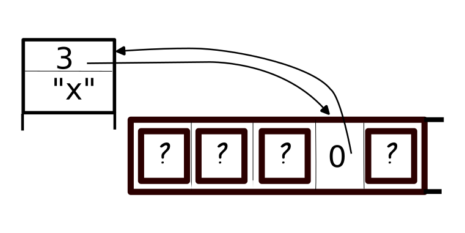

# SIVec: Rust "self-initializing" vector
Copyright (c) 2018 Bart Massey

## Disclaimer

The code in this crate is almost certainly rife with
Undefined Behavior. Given the memory model used by Rust via
LLVM, where uninitialized memory is treeted as a seething
collection of arbitrary values, this seems almost
unavoidable. While the code "works for me", I make no
promises whatsoever that it will work in any important
situation.

## Notes

This crate implements a "self-initializing" vector.  A
self-initializing vector stores values at a sparse
collection of indices, using storage linear in the number of
stored values. Values are created and initialized on first
reference.

The basic idea is to use an uninitialized array of indices
into a stack of index-value pairs. When the array of indices
is referenced, a check is done to see if the stack index is
valid. If so, the value on the stack is used; otherwise a
new pair is pushed onto the stack and the indices array is
set to point at it. Thus, memory is lazily initialized as it
used, on-the-fly.

For example, in this situation

element 3 of the array points to stack slot 0, and stack
slot 0 holds the value "x" and points to element 3. The
uninitialized elements may point anywhere: if they hit stack
slot 0, it will not matter, since the slot "knows" it is for
element 3.

I was told about this data structure in grad school at some
point. See the rustdoc for references.

This code was written as much as an exercise in interior
mutability and unsafe code as because it would be useful for
anything. It has not been extensively tested, and not
benchmarked at all.

## License

This program is licensed under the "MIT License".  Please
see the file LICENSE in the source distribution of this
software for license terms.
